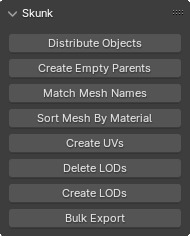

# Blender Skunk

Blender add-on, which provides a set of tools for bulk 3D model processing. This add-on is designed to be used with how Unity so that LODs are imported automatically (see [Import Mesh with LOD settings](https://docs.unity3d.com/6000.0/Documentation/Manual/importing-lod-meshes.html)).

  

## Features

> [!NOTE]
> All features are designed to work for bulk processing - select **root objects** and trigger the appropriate feature

- Distribute Objects - distribute selection on X axis
- Create Empty Parents - create an empty parent object
- Match Mesh Names - match mesh data names to object names
- Sort Mesh By Material - sort mesh data by assigned materials
- Create UVs - create `UV0` and `UV1` channels
- Delete LODs - delete `LOD1` and `LOD2` child objects
- Create LODs - automatically create `LOD1` and `LOD
- Bulk Export - export `.fbx` files to desktop

## Installation

- Download `.zip` file from the [latest release](https://github.com/chark/blender-skunk/releases/latest)
- In Blender, select `Edit > Preferences`
- Open _Add-ons_ tab and click _Install_
- Select the downloaded `.zip` file and click _Install Add-on_

## Releases

- [Latest Release](https://github.com/chark/blender-skunk/releases/latest)
- [Changelog](CHANGELOG.md)
