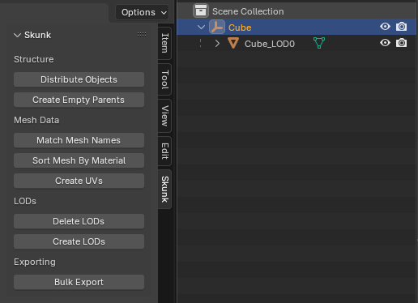

# Blender Skunk 

Blender add-on, which provides a set of tools for bulk 3D model processing. This add-on is designed to be used with Unity, so that LODs are imported automatically (see [Import Mesh with LOD settings](https://docs.unity3d.com/6000.0/Documentation/Manual/importing-lod-meshes.html)).

  

## Features

> [!NOTE]
> All features are designed to work for bulk processing - select **root objects** and trigger the appropriate feature

- Distribute Objects - distribute selected objects on chosen axis
- Create Empty Parents - create an empty parent object for selected objects
- Match Mesh Names - match mesh data names to object names
- Sort Mesh By Material - sort mesh data by assigned materials
- Create UVs - create `UV0` and `UV1` channels
- Delete LODs - delete automatically created LODs
- Create LODs - automatically create LODs
- Bulk Export - export `.fbx` in bulk

## Installation

> [!WARNING]
> This add-on was tested on [Blender v4.3.0](https://www.blender.org/download/), other versions might not work...

- Download `.zip` file from the [latest release](https://github.com/chark/blender-skunk/releases/latest)
- In Blender, select `Edit > Preferences`
- Open _Add-ons_ tab and click _Install_
- Select the downloaded `.zip` file and click _Install Add-on_

## Guide

### 1. Prepare 3D Object

  

Create a 3D object in the scene with the following properties:

- Position: `(0, 0, 0)`
- Rotation: `(0, 0, 0)`
- Scale: `(1, 1, 1)`

### 2. Create Empty Parents

  

Create an empty `Parent Object` for the selected 3D `Object(s)` and parent it as a `Child Object`:

- Select a set of `Objects`
- Click `Create Empty Parents`
- Use `LOD0` as suffix for better Unity support

### 3. Match Mesh Names

  

When importing `.fbx` files, the `Mesh Data` from Blender is reflected as `Mesh` assets in Unity with a matching name. Due to this, it is best to name the `Mesh Data` same as the `Object` containing that data to maintain a clear naming structure and improve search:

- Select `Parent Objects`
- Click `Match Mesh Names`

### 4. UVs

  

You can automatically generate `UV0` and `UV1` channels, `UV1` being used for lightmaps in Unity:

- Select `Parent Objects`
- Click `Crete UVs`
- Adjust automatic UV settings as needed

### 5. LODs

  

Once you have your `LOD0` object setup with UVs and proper naming, you can quickly generate `LOD1` and `LOD2` siblings which are generated using `Decimate Modifier`:

- Select `Parent Objects`
- Click `Create LODs`
- Adjust LOD count and `Decimate` power

### 6. Bulk Export

  
  

After fully preparing the object, you can quickly export it:

- Select `Parent Objects`
- Click `Bulk Export`
- Select directory and adjust settings accordingly
- Import into Unity

## Links

- [Latest Release](https://github.com/chark/blender-skunk/releases/latest)
- [Changelog](CHANGELOG.md)
